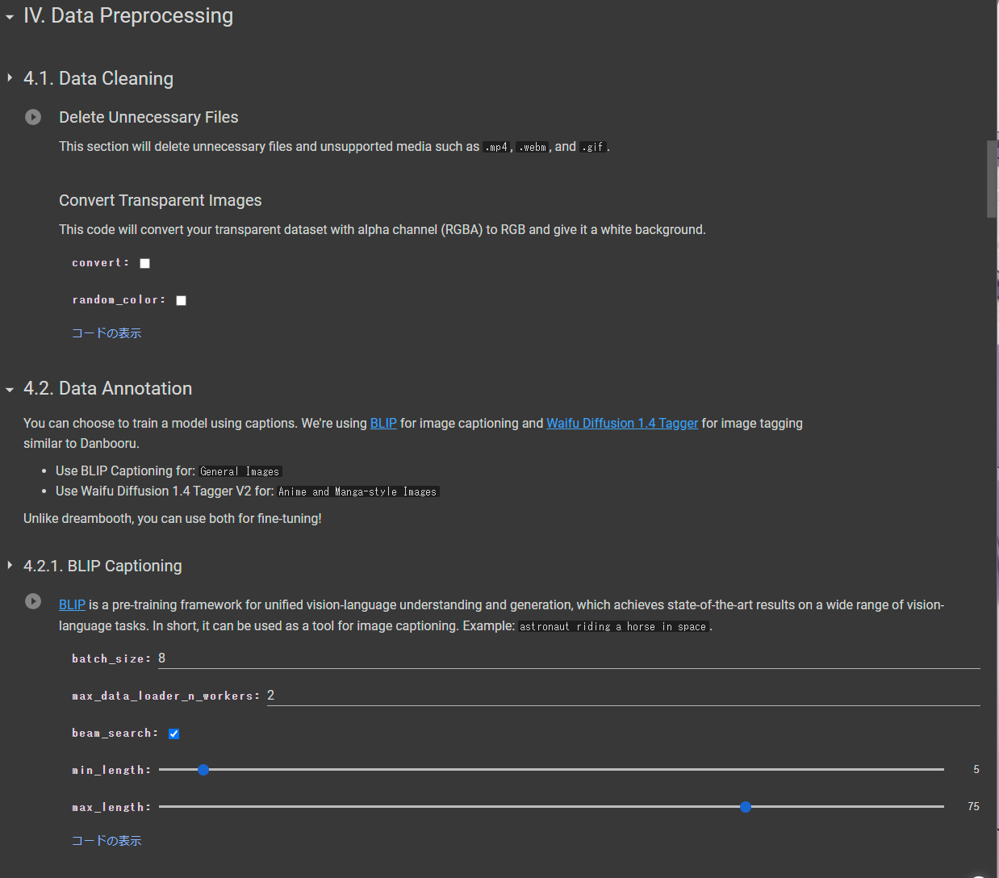

# Linaqruf/kohya-trainer
:::tipこれはなに?
[Linaqruf/kohya-trainer](https://github.com/Linaqruf/kohya-trainer)は、[kohya-ss/sd-scripts](https://github.com/kohya-ss/sd-scripts)を手軽に扱うことができるColabのノートブック
:::

# 使い方
## ノートブックを選ぶ

| Notebook Name | Description | Link | Old Commit |
| --- | --- | --- | --- |
| [Kohya LoRA Dreambooth](https://github.com/Linaqruf/kohya-trainer/blob/main/kohya-LoRA-dreambooth.ipynb) | LoRA Training (Dreambooth method) | [](https://colab.research.google.com/github/Linaqruf/kohya-trainer/blob/main/kohya-LoRA-dreambooth.ipynb) | [](https://colab.research.google.com/github/Linaqruf/kohya-trainer/blob/bc0892647cb17492a106ad1d05716e091eda13f6/kohya-LoRA-dreambooth.ipynb) | 
| [Kohya LoRA Fine-Tuning](https://github.com/Linaqruf/kohya-trainer/blob/main/kohya-LoRA-finetuner.ipynb) | LoRA Training (Fine-tune method) | [](https://colab.research.google.com/github/Linaqruf/kohya-trainer/blob/main/kohya-LoRA-finetuner.ipynb) | [](https://colab.research.google.com/github/Linaqruf/kohya-trainer/blob/fb96280233d3434819ba5850b2c968150c4720f7/kohya-LoRA-finetuner.ipynb) | 
| [Kohya Trainer](https://github.com/Linaqruf/kohya-trainer/blob/main/kohya-trainer.ipynb) | Native Training | [](https://colab.research.google.com/github/Linaqruf/kohya-trainer/blob/main/kohya-trainer.ipynb) | [](https://colab.research.google.com/github/Linaqruf/kohya-trainer/blob/21ad4942a917d3fd1ad6c03d87d16677b427254b/kohya-trainer.ipynb) | 

上記のものから選択してください  
現在もっとも使われているのは、
- Kohya LoRA Dreambooth
- Kohya LoRA Fine-Tuning

なにか大きな問題が発生しない限りは上記の2つを使用します。  
`Link`にある<kbd>Open in Colab</kbd>を押してノートブックを開いてください。

## 1. Kohya Trainerをインストールする

**`ここに text を挿入`となっている部分に`main`と入力**

:::note 設定
- `install_xformers`  
xformersのインストールをするかどうか  
Colabでは限られたリソースで行うため、基本的にはチェック入れておいて問題ありません。

- `mount_drive`
GDriveをローカルのドライブとして使用するかどうかです。  
用途が分からなければ外しておいて問題ありません。  

- `verbose`
実行したコマンドの詳細を表示するオプション  
ログが増えると邪魔なので、外しておいて問題ありません。  
:::

## 2. ベースとなるモデルやvaeをダウンロードする
下記から好きな方法を選んで、取得してください。  


### 2.1. Download Available Model
デフォルトでよく選ばれるモデルが入っています。  
リストからポチポチ選択するだけなので、わざわざモデルを探さなくてよいのが利点 
SD1.xベースとSD2.xベースがありますが、2.xからはかなり負荷がかかりColabではメモリ不足になる可能性が大

### 2.2. Download Custom Model
自分で好きなモデルをダウンロードします  
`ここに text を挿入`の部分にモデルのURLを挿入します  
`https://huggingface.co/user_name/repo_name/resolve/main/Models/dir_name/file_name.extension`の形式になっていることを確認してください  
たとえば、[SD2.1](https://huggingface.co/stabilityai/stable-diffusion-2-1/blob/main/v2-1_768-ema-pruned.ckpt)では、下にある`download`を右クリックからコピーするのがよいでしょう


### ~~2.3.~~ ~~Download Available VAE (Optional)~~
あまり使うことはありません  
基本的にはいらないのでスキップしましょう

## 3. データセットの前準備
データセットの前準備などを行います


### 3.1. Locating Train Data Directory
基本的にはデフォルトの`/content/LoRA/train_data`で問題ありません
もし、GDriveをマウントしていたり、他の分かりやすい場所を指定したい場合は、ご自身で変更してください

### 3.2. Unzip Dataset
データセットを事前に準備し、HuggingFaceにアップロードしている方はこちらを使用してください
:::note 設定
- `zipfile_url`  
横にある`ここに text を挿入`に[Download Custom Model](#22-download-custom-model)のようにダウンロードしてください(URLは適時変更)
- `unzip_to`  
先ほど[データセットの前準備](#3-データセットの前準備)で設定したので、基本的にはここから変更せずに問題ありません
:::

### 3.3. Image Scraper (Optional)
データセットを作成していない方向けです
:::caution 注意!
指定したタグが存在する画像が膨大な数だと、存在する画像をすべてダウンロードします。  
途中でストップするか、タグを絞り込んで対象の画像を減らしてください。
:::
:::note 設定
- `booru`
どのbooru系のサイトからダウンロードするか  
`Danbooru`/`Gelbooru`/`Safebooru`があります  
好みや、画像の数によって変更してください  

- `tag1` `tag2`  
欲しい画像をタグから取得するためのタグを入力します

- `custom_url`
画像をURLからダウンロードします

- `with_aria_2c`  
gallery-dlというライブラリにある、aria2c設定を使用して並列ダウンロードを行います  
最速で5倍から10倍近い速度でのダウンロードが可能になるので、チェックを入れておきましょう
:::

## 4. データセットの整形
:::info
基本的には[Image Scraper (Optional)](#33-image-scraper-optional)でダウンロードした方向けです  
不要な画像やファイルを削除します
:::


### 4.1. Data Cleaning
`Delete Unnecessary Files`  
不要なファイルや、`.mp4` `.webm` `.gif`などのサポートされていないファイルを削除します

`Convert Transparent Images`  
アルファチャンネル(透過情報)を持つ透明な画像を、RGBに変換し、白い背景に自動的に変換します  
- convert
上記の通りです透過画像がないのであれば実行しなくても問題ありません

- random_color
透過した画像の背景を白以外のランダムな色に変更します

### 4.2. Data Annotation
画像のタグ付けを行います 
これにより、自分の生成したいプロンプトなどから呼び出すことができます

### 4.2.1. BLIP Captioning
一般的な背景の画像などをタグ付けします
その際はこちらを使用してください
設定はデフォルトのままで問題ありません

### 4.2.2. Waifu Diffusion 1.4 Tagger V2
[Waifu Diffusion 1.4 Tagger](https://huggingface.co/spaces/SmilingWolf/wd-v1-4-tags)でタグ付けを行います
アニメ調や漫画調、イラストなどはこちらを使用してください
設定はデフォルトのままで問題ありません

### 4.2.3. Custom Caption/Tag (Optional)
特定のタグを挿入したり、削除したりします。
画風のLoRAを作成したい場合は不要です。
:::note 設定
- `extension`
キャプション(タグが入っているファイル)の拡張子  
基本的には`.txt`なのでそのままで問題ありません

- `custom_tag`  
挿入したい、あるいは削除したいタグを挿入

- `append`  
行末に`custom_tag`を入れたい場合に便利です

- `remove_tag`  
不要な`custom_tag`を削除
:::

:::info出力の違い  
```
元のタグ: 1girl, brown hair, school uniform, smile
```

- タグにスペースがある場合は、スペース(` `)をアンダースコア(`_`)に置換:  
	custom_tag: `blue_berry`
    ```
	出力されるタグ: blue berry, 1girl, brown hair, school uniform, smile
    ```

- `append`にチェックを入れると、`custom_tag`は行末にタグを追加  
	custom_tag: `blue_berry`
    ```
	出力されるタグ: 1girl, brown hair, school uniform, smile, blue berry
    ```

- 複数のタグを追加または削除したい場合は、スペース（` `）を追加:  
	custom_tag: `blue_berry red_juice`
    ```
	出力されるタグ: blue berry, red juice, 1girl, brown hair, school uniform, smile
    ```

- タグを削除したい場合は、`remove_tag`にチェックを入れます  
	custom_tag: `brown hair`
    ```
	出力されるタグ: 1girl, school uniform, smile, blue berry
    ```
:::

### 4.3. Merge Annotation Into JSON
データセットが用意できたら、実行します。(必須)  
なにも考えずにポチポチしてください。[locating-train-data-directory](#31-locating-train-data-directory)で変更していた場合は変更してください

### 4.4. Create Buckets & Convert to Latents'
基本はデフォルトで問題ありません。  
変更しても大きな問題が発生しない部分のみ取り上げます。  
:::note 設定
- `max_bucket_reso`  
データセット内の画像を`512,512`/`640,640`/`768,768`に自動的にアップスケール

- `flip_aug`  
チェックを入れると画像をランダムに左右反転させます。(ランダムな構図を出すときに効果あり?)

- `skip_existing_latents`  
すでにlatentがある場合はスキップする(不明なら外したまま)

- `bucket_no_upscale`  
チェックを入れると元の解像度を代わりに使用
:::

## 5. 追加学習を行う
また、それに関連した設定を行っていきます

### 5.1. Model Config
出力されるモデルの設定を生成します。
:::note 設定  
- `v2`/`v_parameterization`  
Stable Diffusion v2.xがベースのモデルの際に使用

- `project_name`
ファイル名になります　　
設定しない場合は`last`となります

- `pretrained_model_name_or_path`
[download-available-model](#21-download-available-model)や[download-custom-model](#22-download-custom-model)でダウンロードしたモデルのパス  
基本は`/content/pretrained_model/ファイル名`です。

- `vae`  
基本的には使いません

- `output_dir`  
モデルやサンプルの画像を出力するディレクトリ

- `output_to_drive`
GDriveに直接出力します。  
個人的にはこれを使うとサンプルの画像などをスマホ側のアプリから見ることができるので、推奨しています。  
その際出力先は`/content/drive/MyDrive/LoRA/output`に固定されます  
:::

### 5.2. Dataset Config
基本的にはデフォルトの設定のままで問題ありません。  

### 5.3. LoRA and Optimizer Config
LoRAの設定ファイルを作成します。  
推奨される設定がいくつかあるので、いくつか変更してください。  
それ以外はデフォルトのままで問題ありません。  

:::note 設定
- `network_category`
`Locon`や`LoHa`などがありますが、基本的にはデフォルトの`LoRA`で問題ありません。

- `conv_dim`/`conv_alpha`  
LoRAでは値を消して空欄にしてください。

- `network_dim`/`network_conv`
`network_dim`は32が推奨されているのでそのままで問題ありません。  
`network_conv`はLoRAでは1が推奨されます。
:::

:::tip 推奨される設定:

| network_category | network_dim | network_alpha | conv_dim | conv_alpha |
| :---: | :---: | :---: | :---: | :---: |
| LoRA | 32 | 1 | - | - |
| LoCon | 16 | 8 | 8 | 1 |
| LoHa | 8 | 4 | 4 | 1 |
:::

### 5.4. Training Config
サンプルの生成時の設定などを行います。
:::note 設定
- `enable_sample_prompt`  
サンプル画像を生成するかどうか 

サンプル画像のプロンプト:
```
ポジティブプロンプト:  
masterpiece, best quality, 1girl, aqua eyes, baseball cap, blonde hair, closed mouth, earrings, green background, hat, hoop earrings, jewelry, looking at viewer, shirt, short hair, simple background, solo, upper body, yellow shirt

ネガティブプロンプト:  
lowres, bad anatomy, bad hands, text, error, missing fingers, extra digit, fewer digits, cropped, worst quality, low quality, normal quality, jpeg artifacts, signature, watermark, username, blurry
```

- `save_n_epochs_type_value`  
何Epoch(学習回数)ごとにLoRAを生成するか  
3を指定したら3Epochごと生成し、最後にもう1度生成する。  

- `save_model_as`
`safetensors`/`ckpt`/`pt`のいずれかから選ぶ  
余程のことがなければ`safetensors`のままでよい

- `seed`  
Epoch(学習回数)の比較のために使用するのであればseed値を固定する
:::

### 5.5. Start Training
以下のファイルが存在しているかを確認し、追加学習を開始します。  
```
sample_prompt: /content/LoRA/config/sample_prompt.txt  
config_file: /content/LoRA/config/config_file.toml  
dataset_config: /content/LoRA/config/dataset_config.toml  
```
